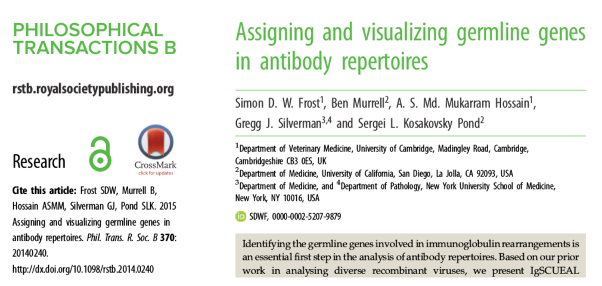
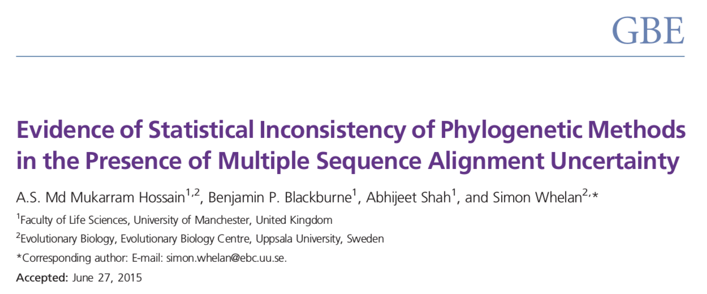
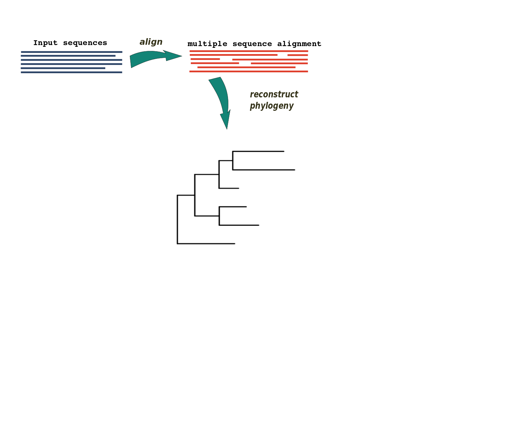
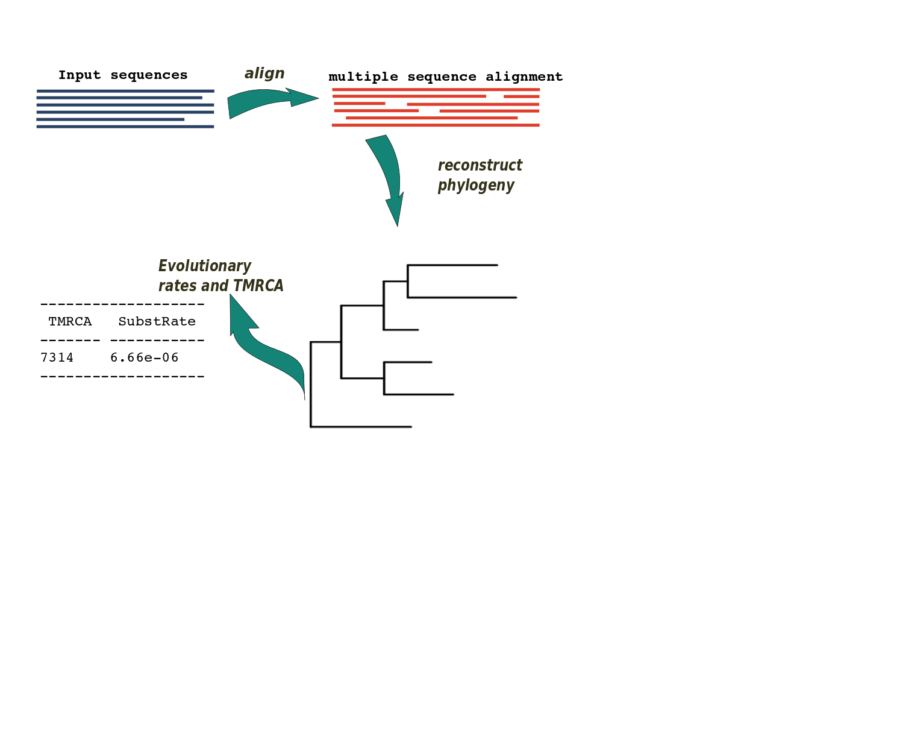
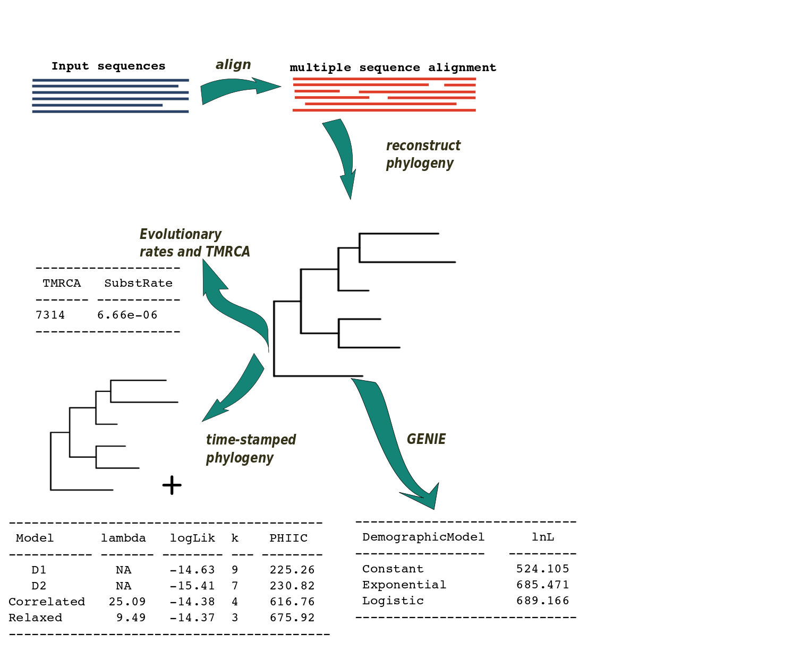
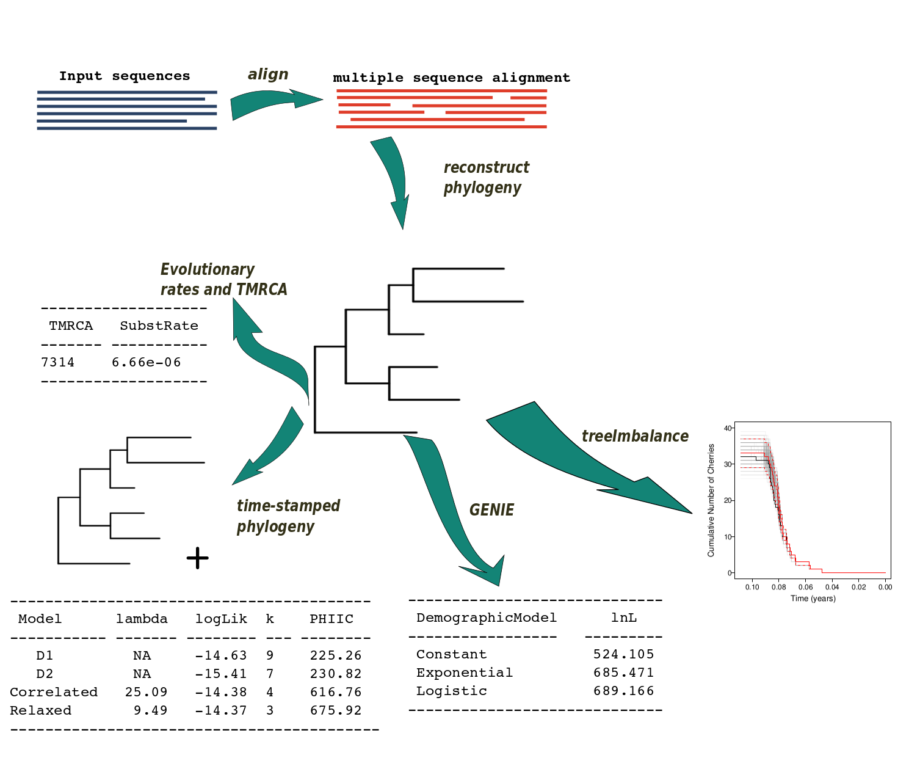
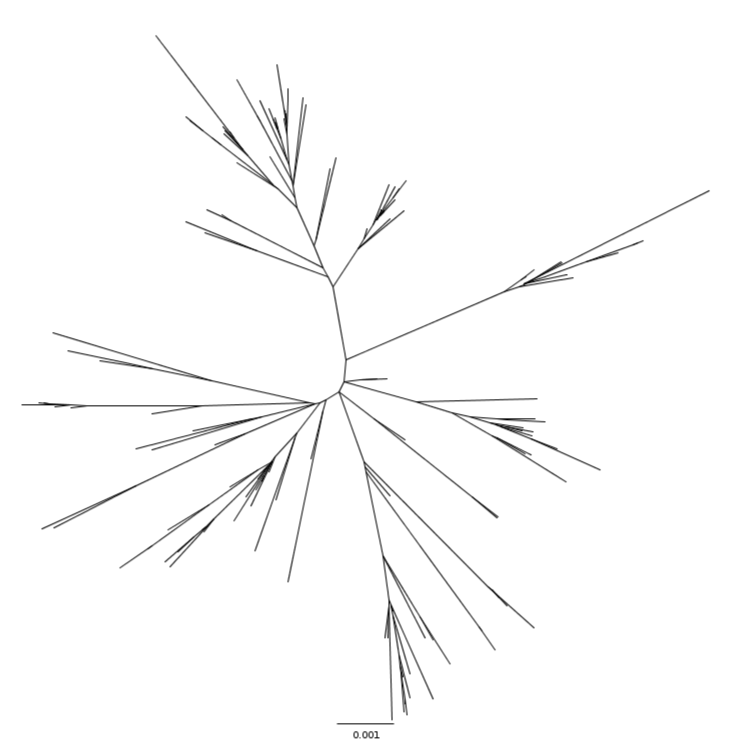
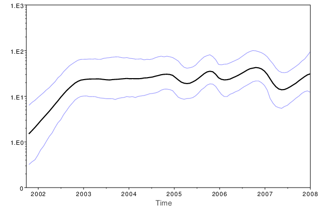

## Annual Virology Immunopath Retreat, 2016
  
**Mukarram Hossain**  
Department of Veterinary Medicine  
University of Cambridge
  
  

&nbsp;

---

      

## Works in 2015

---

## Pipelign

&nbsp;

---

&nbsp;&nbsp;
&nbsp;

---

      

## A phylodynamics pipeline

---

## Viral phylodynamics

- How epidemiological, immunological, and evolutionary processes interact
- Potentially shape viral phylogenies
- Time-sampled viral phylogenies can reveal:
  - Viral genetic variation
  - Information of transmission dynamics

---

## Viral phylodynamics

- Viral phylodynamics typically involve:
  - Calculating evolutionary rates
  - Dating viral origins
  - Quantifying epidemic spread
  - Assessing efficacy of viral control effect
  - Estimating the demographic structure
  - Estimating effective viral population size

---

## Phylodynamic analysis

- Make use of serially sampled pathogen sequence data
- Time-stamped phylogeny is generated from temporal sequence data
- Phylodynamic studies often use sophisticated software packages such as ``BEAST``
- ``BEAST`` uses Bayesian phylogenetic analysis of molecular sequences
- Uses Markov Chain Monte Carlo (MCMC) to obtain posterior estimates
- Provides a distribution of estimates for parameters of interest

---

## MCMC - example

    

[Linear regression problem](http://twiecki.github.io/blog/2013/08/12/bayesian-glms-1/)

[A simple MCMC animation](http://twiecki.github.io/blog/2014/01/02/visualizing-mcmc/)

---

## BEAST - issues

- MCMC is inherently slow to reach stationary distribution
- Computationally expensive for large datasets

&nbsp;

---

## BEAST - issues

- Dataset may contain heterogeneous samples

&nbsp;

---

      

## PhyloPipe

---

## A phylodynamics pipeline

- We have developed a pipeline for phylodynamics studies
- Provides high throughput analysis of time sampled pathogen sequence data
- The pipeline makes use of published computational analysis tools
- Provides rough estimation of the following:
    - Time-stamped phylogeny
    - Evolutionary rates
    - TMRCA
    - Population dynamics
    - Demographic structure
    - and others...
- Can be used to guide initial conditions for ``BEAST`` analysis

---

## PhyloPipe - workflow

&nbsp;

--- 

## PhyloPipe - workflow

&nbsp;

---

## PhyloPipe - workflow

&nbsp;

---

## PhyloPipe - workflow

&nbsp;

---

## PhyloPipe - workflow

&nbsp;

---

## PhyloPipe - workflow

&nbsp;

---

      

## PhyloPipe Example

---

## Dataset - DENV

- 805 DENV-1 WGS from Viet Nam collected between 2003-2008
- Aligned using ``MUSCLE``
- Phylogeny constructed using ``ExaML``
- Root-to-tip distance revealed clusters
- Subdivided into two smaller datasets
    - *G1* contains 140 sequences
    - *G2* contains 665 sequences 

---

## G1 - phylogeny

&nbsp;

---

## G1 - evolutionary rates and TMRCA

                      ----------- ------------- ---------------
                      |          |    TMRCA    |   SubstRate  |
                      |----------|-------------|--------------|
                      | RTT      |   2001.364  |    9.8e-04   |
                      | TREBLE   |   1993.886  |    6.1e-04   |
                      | LSD      |   2000.984  |    7.8e-04   |
                      | BEAST    |   2001.314  |    8.6e-04   |
                      ----------- ------------- ---------------

---

## G1 - Demographic model

                            -------------- --------------
                            |             |     lnL     |
                            |-------------|-------------| 
                            | Constant    |   1244.72   |
                            | Exponential |   1254.89   |
                            | Logistic    |   1265.07   |
                            -------------- --------------

---

## G1 - skyride

Skyride: Palacios and Minin (2012)

Skyride: Drummond, Suchard, Xie and Rambaut (2012)

---

      

## Estimating initial conditions for MCMC

---

## Future works

- Cluster analysis
- Discrete trait analysis

---

## Acknowledgements

- Simon Frost
- Bethany Dearlove
- Fei Xiang

---

      
## Thank you

---

    

